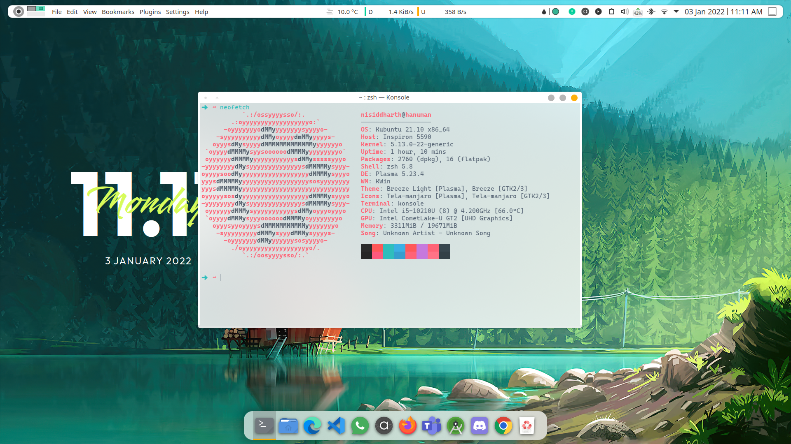
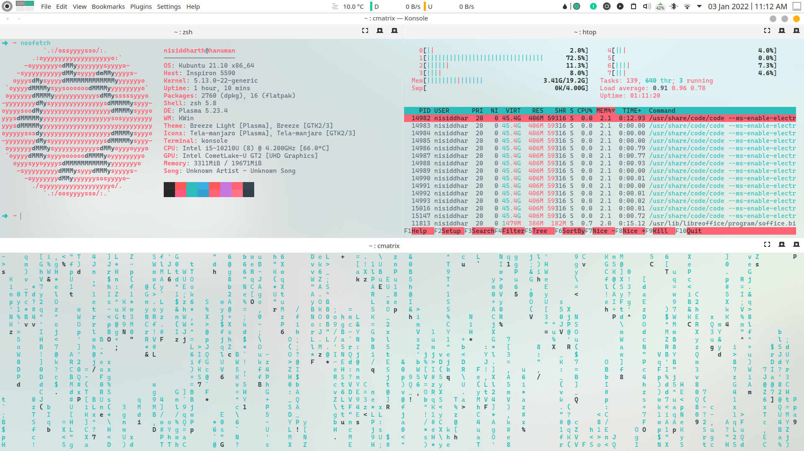

# dotfiles

Collection of files (and dotfiles) I need every time I set up a new GNU/ Linux system (Debian based), also serves as backup.
Wanna get that swag going? Get my dotfiles! (But make sure all packages are installed)

## Desktop Environment: KDE Plasma

<p float="left">
  
  
</p>

Find desktop configuration details [here](desktop_config.md).

<i> All wallpapers are sourced from [r/wallpapers](https://www.reddit.com/r/wallpapers/). No copyright infringement intended. You can ask me to remove them if you want.</i>

## Packages

[apt_installed.txt](./apt_installed.txt) has list of APT packages needed to be installed. [apt_for_ctf.txt] has list of APT packages needed to be installed if installation will be used to play CTFs (and isn't Kali/Parrot).

[i8k_configuration.md](./i8k_configuration.md) has instructions for how to manually configure dell laptop fan bios control in linux systems.

## More instructions

For `tilix` integration in `nautilus` (in case using GTK based DE):

[https://askubuntu.com/questions/1138673/is-filemanager-actions-working-with-19-04/1138682#1138682](https://askubuntu.com/questions/1138673/is-filemanager-actions-working-with-19-04/1138682#1138682)
and
[https://askubuntu.com/questions/76712/setting-nautilus-open-terminal-to-launch-terminator-rather-than-gnome-terminal](https://askubuntu.com/questions/76712/setting-nautilus-open-terminal-to-launch-terminator-rather-than-gnome-terminal)

For JDK 1.8 installation: [https://www.linuxbabe.com/ubuntu/install-oracle-java-8-openjdk-11-ubuntu-18-04-18-10](https://www.linuxbabe.com/ubuntu/install-oracle-java-8-openjdk-11-ubuntu-18-04-18-10)

<hr>

To change default terminal emulator:

```bash
sudo update-alternatives --config x-terminal-emulator
```

To change default shell:

```bash
chsh -s $(which zsh)
```

For oh-my-zsh:

```bash
sh -c "$(curl -fsSL https://raw.githubusercontent.com/ohmyzsh/ohmyzsh/master/tools/install.sh)"
```

For zsh-autosuggestions:

```bash
git clone https://github.com/zsh-users/zsh-autosuggestions ${ZSH_CUSTOM:-~/.oh-my-zsh/custom}/plugins/zsh-autosuggestions
```

For zsh-syntax-highlighting:

```bash
git clone https://github.com/zsh-users/zsh-syntax-highlighting.git ${ZSH_CUSTOM:-~/.oh-my-zsh/custom}/plugins/zsh-syntax-highlighting
```

For powerline-go in bash follow README [here](https://github.com/justjanne/powerline-go). (Or rather don't do it. Who uses bash anyway ¯\\_(ツ)_/¯)

---

To get list of all installed packages run :

```bash
apt-mark showmanual         # gives without description
sudo apt list --installed   # with description
```

---

Install Teams, Zoom, Spotify, Microsoft Edge, Google Chrome, Burpsuite, Android Studio, WPS Office (if needed) using their official packages.

---

I install Touché, KeePassXC, Pitivi using Flatpak.

---

To enable touchpad gestures while using X11 display manager install [Touchégg](https://github.com/JoseExposito/touchegg). It's a great package, uses libinput.

My current config file for the same can be found [here](./.config/touchegg/touchegg.conf).

---

Sublime Text packages I use:

1. A File Icon
2. Meetio Theme (usually not in Linux)
3. SideBarEnhancements
4. LSP
5. LSP-jdtls
6. SublimeLinter
7. SublimeLinter-gcc
8. CoolFormat
9. Terminal

---

*Thank you!*
