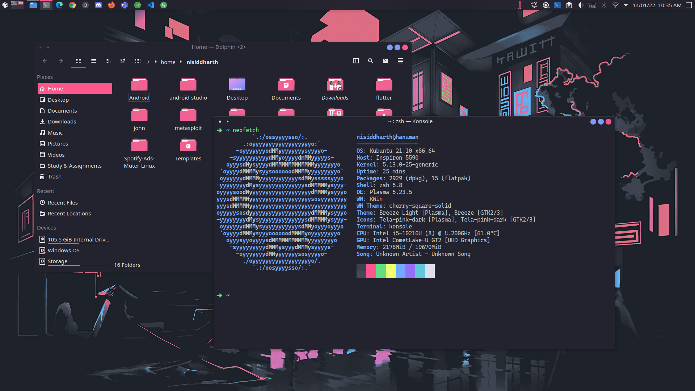

# Desktop

  
  

## Details:

- **DE:** KDE Plasma
- **Global Theme:** Canta-KDE (https://github.com/vinceliuice/canta-kde)
- **Icon Theme:** Tela Manjaro (https://github.com/vinceliuice/tela-icon-theme)
- **Font:** Noto Sans, Cascadia Code PL
- **Wallpaper:** find in [wallpapers](./wallpapers)
- **Panel and Dock:** Latte Dock
- **Widgets:** Weather Report, Network Speed, Color Picker, Better Inline Clock, ClearClock (on Wallpaper).

## Resources:

- Find Latte Dock configuration [here](.config/latte).

## In case want something light:

Use [cherry theme](https://github.com/nullxception/cherry-kde-theme) with default panel instead:

